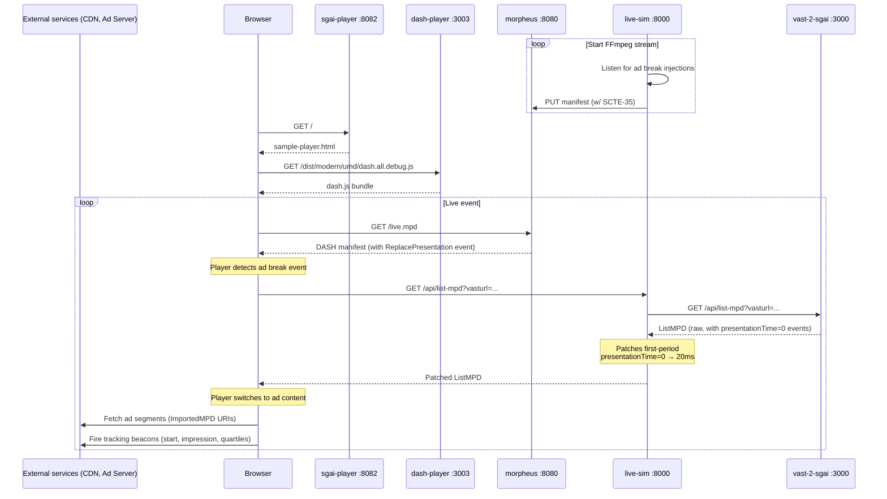
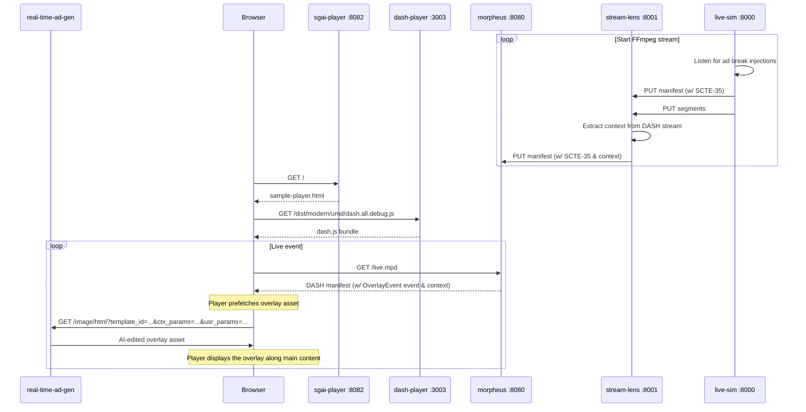

# sgai-demo

A demo environment that wires together Qualabs projects into a single `docker compose up` command, showcasing Server-Guided Ad Insertion (SGAI) for MPEG-DASH with CMCD v2 reporting.

The stack streams a live DASH manifest, injects SCTE-35 ad break markers, converts them to VAST-based alternative content or real-time AI-generated overlay ads via SGAI, and plays everything back in a CMCD-instrumented fork of dash.js.

---

## Architecture

### Alternative MPD flow


### Overlays / context-aware ad generation flow



---

## Services

| Port | Service | Description |
|------|---------|-------------|
| 8082 | `sgai-player` | Demo page — serves `sample-player.html` |
| 3003 | `dash-player` | dash.js webpack dev server — serves compiled player + assets |
| 8080 | `morpheus` | MPEG-DASH manifest server with SCTE-35 → SGAI conversion |
| 8000 | `live-sim` | Live stream simulator — FFmpeg + SCTE-35 injector + ListMPD proxy |
| 8001 | `stream-lens` | AI context analyzer — buffers DASH segments, runs video+audio analysis, fuses into KV context string |
| 3000 | `vast-2-sgai` | VAST-to-SGAI adapter — converts VAST XML into DASH ListMPDs |
| 8888 | `ad-gen-api` | Real-time AI ad generator — generates overlay images via Gemini |
| 3002 | `ad-gen-ui` | Template manager UI for the ad generator |
| 8081 | `ad-gen-db-admin` | MongoDB admin UI for the ad generator |

### `morpheus` — MPEG-DASH server ([qualabs/morpheus](https://github.com/qualabs/morpheus), branch: `feat/scte-to-overlay`)
Custom Nginx module that converts SCTE-35 markers in the incoming MPD into `<ReplacePresentation>` and `<OverlayEvent>` SGAI events and serves the patched manifest to the player.

### `stream-lens` — AI context analyzer ([qualabs/stream-lens](https://github.com/qualabs/stream-lens))
FastAPI service sitting between `live-sim` and `morpheus`. Receives DASH segments from all renditions, buffers the selected rendition, runs parallel video (Gemma 4 via Google AI) and audio (Whisper + librosa) analysis, fuses results into a KV context string (e.g. `ctx_activity=surfing&ctx_mood=energetic`), and forwards all segments and the MPD to morpheus.

### `live-sim` — live stream simulator
Python/aiohttp service that runs FFmpeg to generate a live DASH stream, injects SCTE-35 events on demand, and proxies the vast-2-sgai ListMPD endpoint with a timing patch (see [Known caveats](#known-caveats)).

### `vast-2-sgai` — VAST adapter ([qualabs/vast-2-sgai](https://github.com/qualabs/vast-2-sgai), branch: `main`)
Node.js service that parses a VAST XML file and generates a DASH ListMPD with ad tracking events mapped to `presentationTime` values.

### `real-time-ad-gen` — AI overlay ad generator ([qualabs/real-time-ad-gen](https://github.com/qualabs/real-time-ad-gen))
FastAPI service that generates personalized ad images using Google Gemini. Accepts a template ID and query parameters, returns a PNG cached by SHA-256. Includes a MongoDB backend (GridFS) and a template manager UI.

### `dash-player` — instrumented player ([qualabs/dash.js](https://github.com/qualabs/dash.js), branch: `sgai/alternative-overlays`)
Fork of dash.js with CMCD v2, SGAI alternative-content and overlays support. Served via webpack dev server.

### `sgai-player` — demo page
Minimal nginx container serving `sample-player.html` — loads dash.js from the `dash-player` service and plays back the manifest from `morpheus`.

---

## Prerequisites

- [Docker](https://docs.docker.com/get-docker/) with the Compose plugin (`docker compose`)
- [Git](https://git-scm.com/)

---

## Setup

### Alternative-presentation flow (VAST ads)

Minimal setup — no API key or model download required.

- [ ] `git clone --recurse-submodules <this-repo-url> && cd sgai-demo`
- [ ] `cp .env.example .env`
- [ ] In `.env`, set `OUTPUT_URL=http://morpheus` (routes live-sim directly to morpheus, bypassing stream-lens)
- [ ] `docker compose up --build`
- [ ] Open **http://localhost:8082**

Use the `live-sim` control panel at [http://localhost:8000](http://localhost:8000) to start the stream and inject SCTE-35 ad break events.

If you already cloned without `--recurse-submodules`: `git submodule update --init --recursive`

### Overlay / context-aware ad flow

Builds on top of the VAST flow — can be enabled on a running stack or from scratch.

- [ ] Fill in `GOOGLE_API_KEY` in `.env`
- [ ] *(Optional)* Set `OLLAMA_MODELS_DIR=/path/to/.ollama` in `.env` to reuse local Ollama models
- [ ] Add your template images to `real-time-ad-gen/sample_templates/` (`banner.png`, `skyscraper.png`, `lshape-left.png`, `lshape-right.png`)
- [ ] Run `./setup.sh` — pre-pulls the Ollama fusion model and registers the sample templates, printing each UUID
      *(or run independently: `./stream-lens/pull-models.sh` and `./real-time-ad-gen/setup-templates.sh`)*
- [ ] In `.env`, set one or more of `MORPHEUS_BANNER_QUERY` / `MORPHEUS_SKYSCRAPER_QUERY` / `MORPHEUS_LSHAPE_RIGHT_QUERY` / `MORPHEUS_LSHAPE_LEFT_QUERY` to `template_id=<uuid>` (the player appends the remaining query params)
- [ ] `docker compose up --build` (or `docker compose restart` if stack is already running)
- [ ] Open **http://localhost:8082** — overlay ads with AI-generated context now appear

---

## Running the overlay demo

Once the stack is up and configured for the overlay flow, follow these steps to watch an AI-generated context-aware ad appear over the live stream.

### 1. Start the stream

Open the live-sim control panel at **http://localhost:8000**.

- **SMPTE bars (default):** click **Start stream** — no extra config needed.
- **Custom video:** set `LIVE_SIM_VIDEO=/media/<filename>` in `.env`, drop the file in `live-sim/media/`, restart `live-sim`, then click **Start stream**.

The player at **http://localhost:8082** should start playing the live stream within a few seconds.

### 2. Wait for a context analysis cycle

stream-lens continuously analyzes the incoming video and audio. The current context string (e.g. `ctx_activity=surfing&ctx_mood=energetic`) is overlaid on the player screen once the first cycle completes — this usually takes 15–30 s after stream start.

The ad will be generated using this context, so wait until it appears before injecting the break.

### 3. Inject the ad break

Back in the live-sim control panel, click **Inject ad break**.

Morpheus notifies the player 35 s before the break starts (`earliestResolutionTime=35000`). The player uses this window to pre-fetch the overlay — it immediately calls `real-time-ad-gen` with the template ID and context parameters. This lead time is necessary because Gemini image generation typically takes 10–20 s, and the overlay must be ready before the break begins.

When the break arrives, the overlay ad appears on top of the main content.

### 4. Inspect the generated image

Open the ad generator UI at **http://localhost:3002** and go to the **History** tab. You can see:

- The generated image
- The full prompt that was sent to Gemini (template type description + template description + context + user params)
- Generation latency
- Cache status (HIT / MISS) — re-injecting the same break with the same context will return the cached image instantly

---

## Configuration reference

### Overlay ad URLs (morpheus)

Morpheus builds each overlay `uri` in the served MPD as:

```
${AD_GEN_BASE_URL}/image/html?${MORPHEUS_<SHAPE>_QUERY}
```

These are resolved by the **player (browser)**, not by morpheus, so `AD_GEN_BASE_URL` must point to a host the browser can reach: `http://localhost:8888` for same-machine, or a LAN IP like `http://192.168.68.85:8888` when serving the demo to other machines.

| Variable | Description |
|----------|-------------|
| `AD_GEN_BASE_URL` | host:port of the ad-gen API as the browser must reach it (default: `http://localhost:8888`) |
| `MORPHEUS_BANNER_QUERY` | `template_id=<uuid>` for the banner overlay |
| `MORPHEUS_SKYSCRAPER_QUERY` | `template_id=<uuid>` for the skyscraper overlay |
| `MORPHEUS_LSHAPE_RIGHT_QUERY` | `template_id=<uuid>` for the L-shape (right) overlay |
| `MORPHEUS_LSHAPE_LEFT_QUERY` | `template_id=<uuid>` for the L-shape (left) overlay |

The player appends context and user parameters at request time — only the template ID needs to be set here.

All five are **optional**. If unset or empty, morpheus falls back to compiled defaults (`localhost:8888` + the default templates), so the demo still runs with no config. To apply changes, restart morpheus:

```bash
docker compose up -d morpheus
```

### Background video (live-sim)

By default `live-sim` streams a synthetic `smptehdbars` test pattern with a LOCAL/UTC timecode overlay drawn on every frame, plus a synthetic beep audio track — so the demo runs with no config and no media files present.

To use a real video instead, set `LIVE_SIM_VIDEO` to a path **inside the container**. The host directory `live-sim/media/` is mounted at `/media` in the container (`./live-sim/media:/media`), so drop a video file there and point the variable at it:

| Variable | Description |
|----------|-------------|
| `LIVE_SIM_VIDEO` | Path inside the container to a background video (e.g. `/media/surf.mp4`). Optional. |

Behavior:

- **Set and the file exists:** FFmpeg loops the file infinitely, uses the **file's own audio**, and **omits** the timecode overlay.
- **Unset/empty or the file is missing:** falls back to the synthetic SMPTE-bars source with the timecode overlay (the default).

Files dropped in `live-sim/media/` are never committed (a `.gitignore` ignores everything but itself). To change the video, edit `.env` and restart `live-sim`:

```bash
docker compose up -d live-sim
```

---

## Known caveats

### Ad tracking events fire before playback starts (pre-buffering latency)

Due to pre-buffering, the DASH player may trigger tracking events with `presentationTime="0"` (e.g. `start`, `impression`) before the ad actually begins playing, because the alternative content is already loaded and at time 0 when the EventManager fires.

**Fix:** The `live-sim` `/api/list-mpd` proxy already handles this by delaying `presentationTime="0"` events in the first ad period by 20 ms. For this to work, Morpheus must point to `live-sim` instead of `vast-2-sgai` directly.

In `morpheus/ngx_morpheus_internal.cpp`, line 13, change the hardcoded ListMPD URL from port `3000` to port `8000`:

```cpp
// Before
{1, "http://localhost:3000/api/list-mpd?vasturl=http://localhost:3000/samples/dash-alt-mpd/vast-sample.xml"},

// After
{1, "http://localhost:8000/api/list-mpd?vasturl=http://localhost:3000/samples/dash-alt-mpd/vast-sample.xml"},
```

---

## Pinned submodule commits

The submodules are pinned to specific commits that are known to work with this demo. Using different commits may break the integration.

| Submodule | Commit |
|-----------|--------|
| `dash.js` | `3ea7d4f9b2047d49e2a92ebe502c8cb649bebf68` |
| `morpheus` | `3b71cca754ea56560629c5a340e22cf1633a8443` |
| `vast-2-sgai` | `d18e495ec558cffef70ab5efca94c9fbcfd357a3` |
| `real-time-ad-gen` | `b4b787ddb91b7fbc24f44916b9213ea90a9d685c` |
| `stream-lens` | `29fe586c61a59e5ff1b000e7a1950fa5a7926870` |

If you update a submodule and the demo breaks, reset it to the pinned commit:

```bash
cd <submodule-dir>
git checkout <commit-hash>
cd ..
git add <submodule-dir>
git commit -m "revert <submodule> to known-good commit"
```

To pin to a different commit (e.g. after verifying a newer version works):

```bash
cd <submodule-dir>
git fetch
git checkout <new-commit-hash>
cd ..
git add <submodule-dir>
git commit -m "pin <submodule> to <new-commit-hash>"
```

Then update the commit hash in the table above so this README stays in sync.

---

## Updating submodules

To pull the latest commits from all upstream branches:

```bash
git submodule update --remote --merge
```

# SMPTE bar stream FFmpeg command

The SMPTE bars live stream is generated using the following command:

```python
FFMPEG_CMD = [
    "ffmpeg",
    "-re",
    "-f", "lavfi", "-i", "smptehdbars=size=1920x1080:rate=30",
    "-f", "lavfi", "-i", "aevalsrc=exprs='if(lt(mod(t\\,1)\\,0.08)\\,sin(2*PI*1000*t)\\,0)|if(lt(mod(t\\,1)\\,0.08)\\,sin(2*PI*1000*t)\\,0):sample_rate=48000",
    "-map", "0:v", "-map", "1:a",
    "-vf", (
        "realtime,"
        "drawtext="
        "fontfile=/usr/share/fonts/truetype/dejavu/DejaVuSans-Mono.ttf:"
        r"text='LOCAL\: %{localtime\:%T}.%{eif\:mod(t\,1)*1000\:d\:3}':"
        "fontcolor=white:fontsize=80:box=1:boxcolor=black@0.8:"
        "x=(w-text_w)/2:y=(h-text_h)/2-60,"
        "drawtext="
        "fontfile=/usr/share/fonts/truetype/dejavu/DejaVuSans-Mono.ttf:"
        r"text='UTC\: %{gmtime\:%T}.%{eif\:mod(t\,1)*1000\:d\:3}':"
        "fontcolor=yellow:fontsize=80:box=1:boxcolor=black@0.8:"
        "x=(w-text_w)/2:y=(h-text_h)/2+60"
    ),
    "-c:v", "libx264", "-preset", "ultrafast", "-tune", "zerolatency",
    "-crf", "28", "-g", "60",
    "-pix_fmt", "yuv420p",
    "-c:a", "aac", "-b:a", "128k",
    "-f", "dash",
    "-streaming", "1",
    "-seg_duration", "2",
    "-window_size", "10",
    "-extra_window_size", "5",
    "-use_timeline", "1",
    "-use_template", "1",
    "-remove_at_exit", "0",
    str(MPD_PATH),
]
```

## FFmpeg Command Reference

| Argument | Value | Description |
|---|---|---|
| `-re` | — | Read input at native framerate, preventing the lavfi source from generating frames faster than real time |
| `-f lavfi` | — | Use the libavfilter virtual device as input source |
| `-i` | `smptehdbars=size=1920x1080:rate=30` | Generate SMPTE HD color bars at 1080p, 30 fps |
| `-f lavfi` | — | Second virtual input source for audio |
| `-i` | `evalsrc=exprs=...` | Generate a 1 kHz sine tone at 48000 Hz every second (broadcast standard sample rate, useful for audio sync verification) |
| `-map 0:v` | — | Map video from the first input (color bars) |
| `-map 1:a` | — | Map audio from the second input (sine click) |
| `-vf` | `realtime,...` | Apply video filters (see below) |
| `-c:v` | `libx264` | Encode video with H.264 |
| `-preset` | `ultrafast` | Use the fastest x264 encoding preset to minimize encoder latency |
| `-tune` | `zerolatency` | Disable B-frames and lookahead to reduce end-to-end stream latency |
| `-crf` | `28` | Constant Rate Factor — controls quality/bitrate tradeoff (lower = better quality; 28 is suitable for test streams) |
| `-g` | `60` | GOP size (keyframe interval): 2 seconds × 30 fps, aligned with DASH segment duration |
| `-pix_fmt` | `yuv420p` | Output pixel format, required for broad player compatibility |
| `-c:a` | `aac` | Encode audio with AAC |
| `-b:a` | `128k` | Audio bitrate |
| `-f` | `dash` | Output as MPEG-DASH |
| `-streaming` | `1` | Enable low-latency streaming mode in the DASH muxer |
| `-seg_duration` | `2` | Each DASH segment is 2 seconds long |
| `-window_size` | `10` | Number of segments kept in the manifest at any time |
| `-extra_window_size` | `5` | Additional segments retained on disk beyond the window |
| `-use_timeline` | `1` | Include `SegmentTimeline` in the MPD manifest |
| `-use_template` | `1` | Use a `SegmentTemplate` in the MPD (required for live streaming) |
| `-remove_at_exit` | `0` | Keep segment files on disk when the process exits |
| *(output)* | `MPD_PATH` | Path to the `.mpd` manifest file |

### Video Filters (`-vf`)

| Filter | Description |
|---|---|
| `realtime` | Throttles the filter graph to real time, preventing frame bursts from a lavfi source |
| `drawtext` (GMT-3) | Overlays the current time offset to **GMT-3** (UTC − 3 h) with milliseconds in white, centered slightly above the frame midpoint |
| `drawtext` (UTC) | Overlays the current **UTC time** with milliseconds in yellow, centered slightly below the frame midpoint |