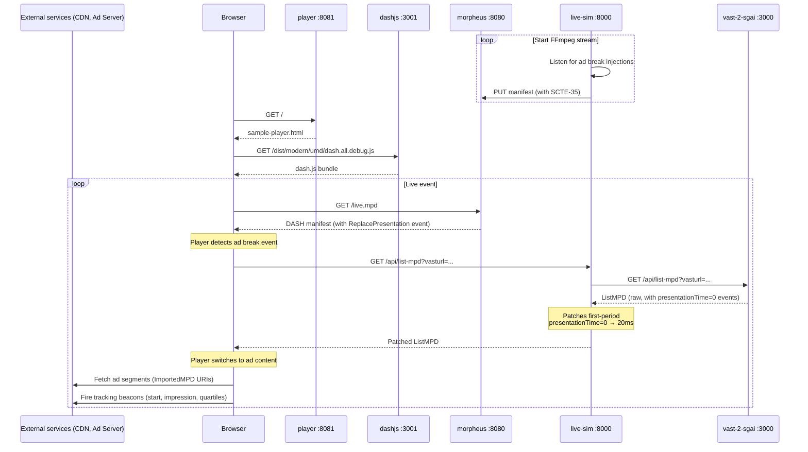

# morpheus-vast-demo

A demo environment that wires together four Qualabs projects into a single `docker compose up` command, showcasing Server-Guided Ad Insertion (SGAI) for MPEG-DASH with CMCD v2 reporting.

The stack streams a live DASH manifest, injects SCTE-35 ad break markers, converts them to VAST-based alternative content via SGAI, and plays everything back in a CMCD-instrumented fork of dash.js.

---

## Architecture



---

## Services

| Port | Service | Description |
|------|---------|-------------|
| 8081 | `player` | Demo page — serves `sample-player.html` |
| 3001 | `dashjs` | dash.js webpack dev server — serves compiled player + assets |
| 8080 | `morpheus` | MPEG-DASH manifest server with SCTE-35 → SGAI conversion |
| 8000 | `live-sim` | Live stream simulator — FFmpeg + SCTE-35 injector + ListMPD proxy |
| 3000 | `vast-2-sgai` | VAST-to-SGAI adapter — converts VAST XML into DASH ListMPDs |

### `morpheus` — MPEG-DASH server ([qualabs/morpheus](https://github.com/qualabs/morpheus), branch: `feat/docker-image`)
Custom Nginx module that converts SCTE-35 markers in the incoming MPD into `<ReplacePresentation>` SGAI events and serves the patched manifest to the player.

### `live-sim` — live stream simulator
Python/aiohttp service that runs FFmpeg to generate a live DASH stream, injects SCTE-35 events on demand, and proxies the vast-2-sgai ListMPD endpoint with a timing patch (see [Known caveats](#known-caveats)).

### `vast-2-sgai` — VAST adapter ([qualabs/vast-2-sgai](https://github.com/qualabs/vast-2-sgai), branch: `main`)
Node.js service that parses a VAST XML file and generates a DASH ListMPD with ad tracking events mapped to `presentationTime` values.

### `dashjs` — instrumented player ([qualabs/dash.js](https://github.com/qualabs/dash.js), branch: `sgai/alternative-cmcd`)
Fork of dash.js with CMCD v2 and SGAI alternative-content support. Served via webpack dev server.

### `player` — demo page
Minimal nginx container serving `sample-player.html` — loads dash.js from the `dashjs` service and plays back the manifest from `morpheus`.

---

## Prerequisites

- [Docker](https://docs.docker.com/get-docker/) with the Compose plugin (`docker compose`)
- [Git](https://git-scm.com/)

---

## Setup

### 1. Clone with submodules

```bash
git clone --recurse-submodules <this-repo-url>
cd morpheus-vast-demo
```

If you already cloned without `--recurse-submodules`:

```bash
git submodule update --init --recursive
```

### 2. Configure environment variables

Copy the root-level example and fill in required values:

```bash
cp .env.example .env
```

Key variables in `.env`:

| Variable | Description |
|----------|-------------|
| `GOOGLE_API_KEY` | Google API key for Gemini image generation in `live-sim` |
| `VAST2SGAI_URL` | Internal URL for vast-2-sgai (default: `http://vast-2-sgai:3000`) |
| `MORPHEUS_URL` | Internal URL for Morpheus (default: `http://morpheus`) |

`vast-2-sgai` uses its own `.env` inside the submodule:

```bash
cp vast-2-sgai/.env.example vast-2-sgai/.env
```

### 3. Build and start all services

```bash
docker compose up --build
```

The first build takes a few minutes — the `dashjs` image installs all npm dependencies.

### 4. Open the demo

Navigate to [http://localhost:8081](http://localhost:8081).

The manifest URL is pre-filled with `http://localhost:8080/live.mpd`. Use the `live-sim` control panel at [http://localhost:8000](http://localhost:8000) to start the FFmpeg stream and inject SCTE-35 ad break events.

---

## Known caveats

### Ad tracking events fire before playback starts (pre-buffering latency)

Due to pre-buffering, the DASH player may trigger tracking events with `presentationTime="0"` (e.g. `start`, `impression`) before the ad actually begins playing, because the alternative content is already loaded and at time 0 when the EventManager fires.

**Fix:** The `live-sim` `/api/list-mpd` proxy already handles this by delaying `presentationTime="0"` events in the first ad period by 20 ms. For this to work, Morpheus must point to `live-sim` instead of `vast-2-sgai` directly.

In `morpheus/ngx_morpheus_internal.cpp`, line 13, change the hardcoded ListMPD URL from port `3000` to port `8000`:

```cpp
// Before
{1, "http://localhost:3000/api/list-mpd?vasturl=http://localhost:3000/samples/dash-alt-mpd/vast-sample.xml"},

// After
{1, "http://localhost:8000/api/list-mpd?vasturl=http://localhost:3000/samples/dash-alt-mpd/vast-sample.xml"},
```

---

## Updating submodules

To pull the latest commits from all upstream branches:

```bash
git submodule update --remote --merge
```
